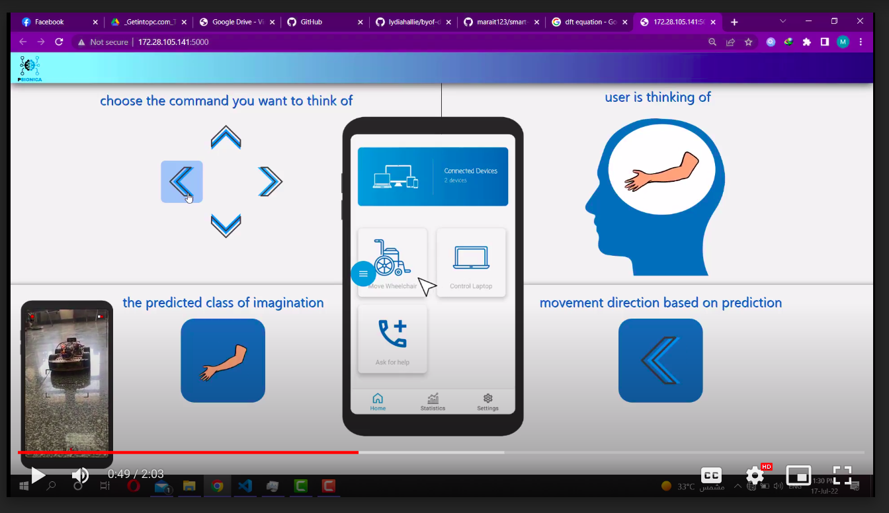

# smart-chair

## System Idea

### Document
[Psionica_Manual](./Psionica_Book.pdf)

### Video Demo (arabic explanation)
watch the video below showing a demo of our system

[Psionica_video_url](https://drive.google.com/file/d/1rGw0xnJ_4oBFd6LWkM8to3Xf26GLz1Xt/view)

## folder Structure

    .
    ├── chair-code                   # wheelchair code written in C++ & shell

    ├── web-app                   # simulator code Written in js,html,css,python,flask,..etc.

    └── README.md
