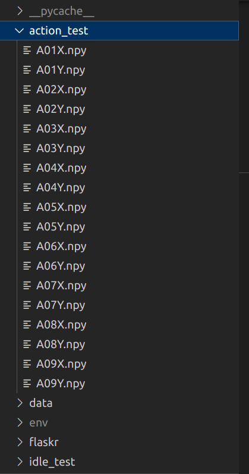

# Flask Recap

A simple flask server to demonstrate basic flask.

## Getting Started
### requirements 
1. you should have test for action thinking samples placed in folder action_test 

2. you should have test for idle thinking samples placed in folder action_test 

### Create a Virutal Enviornment

Follow instructions [here](https://packaging.python.org/guides/installing-using-pip-and-virtual-environments/) to create and activate virtual enviornment for this project.

### Install Dependencies

Run `pip install -r requirements.txt` to install any dependencies.

### Install Postman

Follow instructions on the [Postman docs](https://www.getpostman.com/) to install and run postman. Once postman is running, import the collection `./udacity-fsnd-flaskrecap.postman_collection.json`.

### Run the Server

<b>running using gitbash</b>

On first run, execute `export FLASK_APP=flaskr`. Then run `flask run --reload` to run the developer server.

<b>running using powershell</b>

```powershell
$ENV:FLASK_DEBUG=1
$ENV:FLASK_APP="flaskr"
flask run --reload --host=0.0.0.0
```
<b>running on linux</b>
```bash
source env/bin/activate
export FLASK_APP=flaskr
export FLASK_DEBUG=1
flask run --reload --host=0.0.0.0

```
### Run the GUI

`python -m flaskr`

### Run the testing
* Change “python” to “coverage run”, so this:
```bash
$ python -m unittest discover
```
* becomes:
```bash
$ coverage run -m unittest discover
```
* Use coverage report to report on the results:
```bash
$ coverage report -m
```
For a nicer presentation, use coverage html to get annotated HTML listings detailing missed lines:
```bash
$ coverage html
```